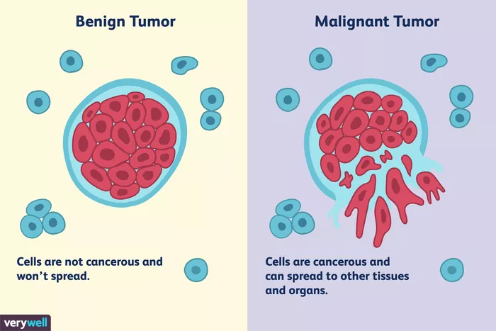

# Analysis-and-Prediction-of-Tumors-Using-Machine-Learning-

## About the DATASET ...

Features are computed from a digitized image of a fine needle aspirate (FNA) of a breast mass. They describe characteristics of the cell nuclei present in the image.
n the 3-dimensional space is that described in: [K. P. Bennett and O. L. Mangasarian: "Robust Linear Programming Discrimination of Two Linearly Inseparable Sets", Optimization Methods and Software 1, 1992, 23-34].

This database is also available through the UW CS ftp server:
ftp ftp.cs.wisc.edu
cd math-prog/cpo-dataset/machine-learn/WDBC/

Also can be found on UCI Machine Learning Repository: https://archive.ics.uci.edu/ml/datasets/Breast+Cancer+Wisconsin+%28Diagnostic%29

Attribute Information:

1) ID number
2) Diagnosis (M = malignant, B = benign)
3-32)

Ten real-valued features are computed for each cell nucleus:

a) radius (mean of distances from center to points on the perimeter)
b) texture (standard deviation of gray-scale values)
c) perimeter
d) area
e) smoothness (local variation in radius lengths)
f) compactness (perimeter^2 / area - 1.0)
g) concavity (severity of concave portions of the contour)
h) concave points (number of concave portions of the contour)
i) symmetry
j) fractal dimension ("coastline approximation" - 1)

The mean, standard error and "worst" or largest (mean of the three
largest values) of these features were computed for each image,
resulting in 30 features. For instance, field 3 is Mean Radius, field
13 is Radius SE, field 23 is Worst Radius.

All feature values are recoded with four significant digits.

Missing attribute values: none

Class distribution: 357 benign, 212 malignant

#### A tumor is an abnormal lump or growth of cells. When the cells in the tumor are normal, it is benign. Something just went wrong, and they overgrew and produced a lump. When the cells are abnormal and can grow uncontrollably, they are cancerous cells, and the tumor is malignant.

#### I have tried to compare the 2 tumors- benign and malignant & I have added visualisatiion to show that how are these two tumors different then I have applied various classification models for predictions for given features that whether the tumour is B or M. I have also illustrated the importance of feature scaling.

# Benign Tumors: Noncancerous
If the cells are not cancerous, the tumor is benign. It won't invade nearby tissues or spread to other areas of the body (metastasize). A benign tumor is less worrisome unless it is pressing on nearby tissues, nerves, or blood vessels and causing damage.1 Fibroids in the uterus or lipomas are examples of benign tumors.

Benign tumors may need to be removed by surgery.1 They can grow very large, sometimes weighing pounds. They can be dangerous, such as when they occur in the brain and crowd the normal structures in the enclosed space of the skull. They can press on vital organs or block channels.

Some types of benign tumors such as intestinal polyps are considered precancerous and are removed to prevent them becoming malignant. Benign tumors usually don't recur once removed, but if they do it is usually in the same place.

# Malignant Tumors: Cancerous
Malignant means that the tumor is made of cancer cells, and it can invade nearby tissues. Some cancer cells can move into the bloodstream or lymph nodes, where they can spread to other tissues within the body—this is called metastasis.2 Cancer can occur anywhere in the body including the breast, intestines, lungs, reproductive organs, blood, and skin.

For example, breast cancer begins in the breast tissue and may spread to lymph nodes in the armpit if it's not caught early enough and treated. Once breast cancer has spread to the lymph nodes, the cancer cells can travel to other areas of the body, like the liver or bones.

The breast cancer cells can then form tumors in those locations. A biopsy of these tumors might show characteristics of the original breast cancer tumor.

## VISUALIZATION ...

### Bar Garph

### Pie Chart

### Pair Plot (Radius, Texture, Perimeter, Area)

# FOLLOWNG GRAPHS SHOW THE DIFFERENCE BETWEEN VARIOUS PARAMTERS OF BENIGN AND MALIGNANT TUMORS

### Radius Mean vs Concavity Mean (Benign)

### Radius Mean vs Concavity Mean (Malignant)

# ABOVE TWO GRAPHS PROVE THE DIFFERENCE BETWEEN 2 TUMORS

### Radius Mean vs Texture Mean (Benign)

### Radius Mean vs Texture Mean (Malignant)

### Pair Grid (Radius, Texture, Perimeter, Area, Smoothness) _ Benign 

### Pair Grid (Radius, Texture, Perimeter, Area, Smoothness) _ Malignant 

### Correlation Map

# RESULTS :

## FITTING & TESTING DIFFERENT CLASSIFICATION MODELS ( without scaling the data )
Random Forest :  95.61% ,
Decision Tree :  94.73% ,
Support Vector Machine :  90.35% ,
K Nearest Neighbours :  93.85% ,
Naive Bayes Algorithm :  94.73%
### Random Forest and Naive Bayes Algorithm performs best ..
### SVM performs worst ..
 
 
## FITTING & TESTING DIFFERENT CLASSIFICATION MODELS ( with scaled data )
Random Forest :  95.61% ,
Decision Tree :  94.73% ,
Support Vector Machine :  97.36% ,
K Nearest Neighbours :  95.61% ,
Naive Bayes Algorithm :  94.73%
### After Scaling the Data .. SVM performs best of all ..
